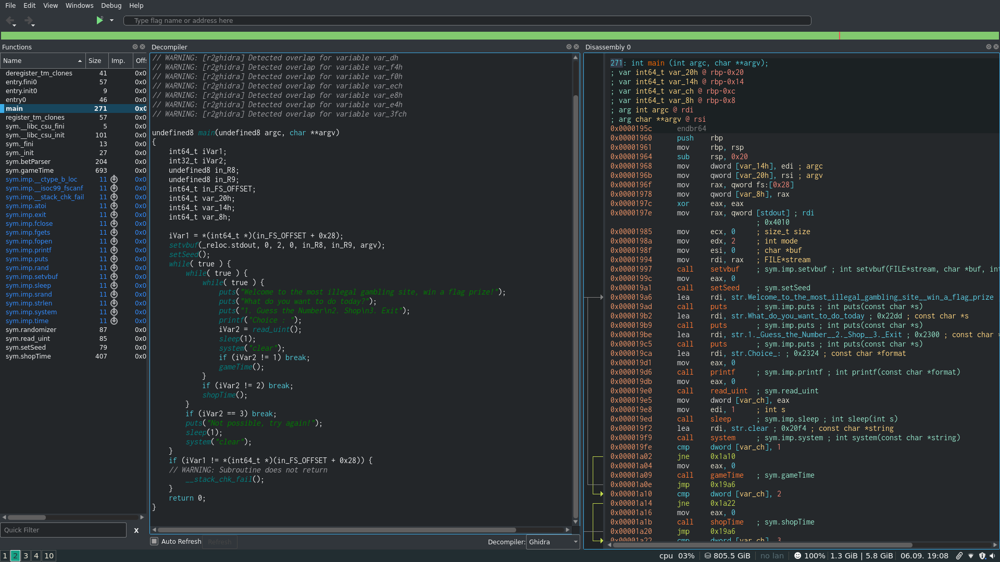
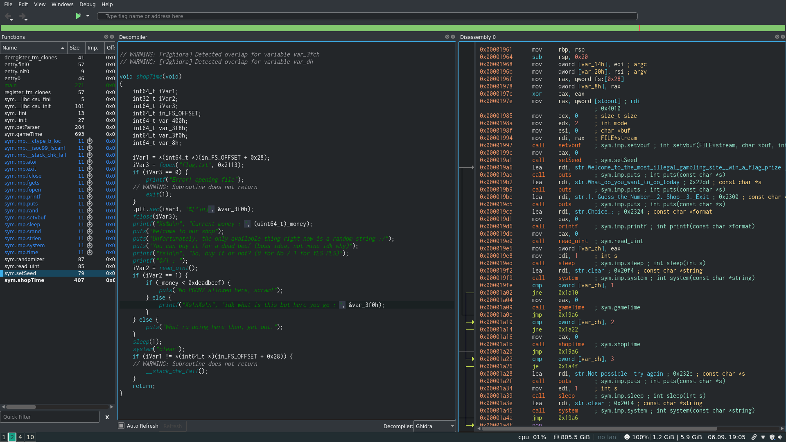
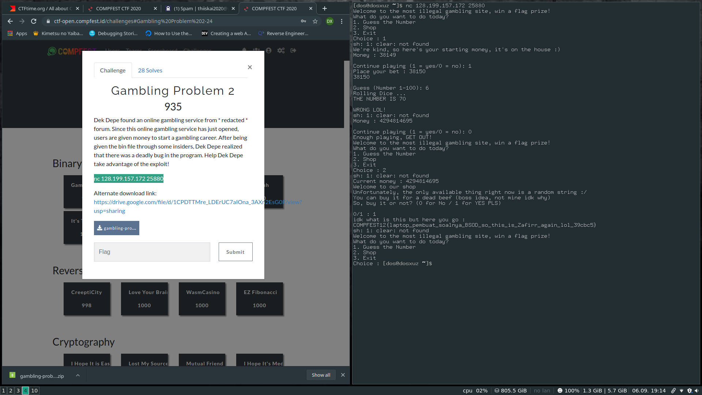

# COMFEST CTF 

## Gambling Problem 2

Points : 935

Description : 

```
Dek Depe found an online gambling service from * redacted * forum. Since this online gambling service has just opened, users are given money to start a gambling career. After being given the bin file through some insiders, Dek Depe realized that there was a deadly bug in the program. Help Dek Depe take advantage of the exploit!
```

### Checking the source code

Upong checking the main function, we see that, there are 3 while loops. The `gameTime()` function, takes an input from the user and generates a random value. 

```
./gamblingProblem 
Welcome to the most illegal gambling site, win a flag prize!
What do you want to do today?
1. Guess the Number
2. Shop
3. Exit
Choice :
```

```
We're kind, so here's your starting money, it's on the house :)
Money : 6803

Continue playing (1 = yes/0 = no):1
Place your bet : 23
23

Guess (Number 1-100): 4
Rolling Dice ... 
THE NUMBER IS 96

WRONG LOL!
```

So you need to guess the number which the computer will put out. But before that you need to place a bet. If you guess the wrong number, it will deduct that from you money.



The above is the main function.

### The shopTime function



The `shopTime()` function is the one which actually reads the flag. But it checks if you have more money than `0xdeadbeef` which you'll not get by default.


### Bug in the gameTime function


Since the `gameTime` function actually deducts from your current money, what if you place more bet than the amount of money you have. There will be an integer overflow. As a result you'll have more money than `0xdeadbeef`. 


So when asked to place the bet, I entered one more than the amount of money I was given and the final amount was much more.

So when I tried the buy option, I got the flag : 



