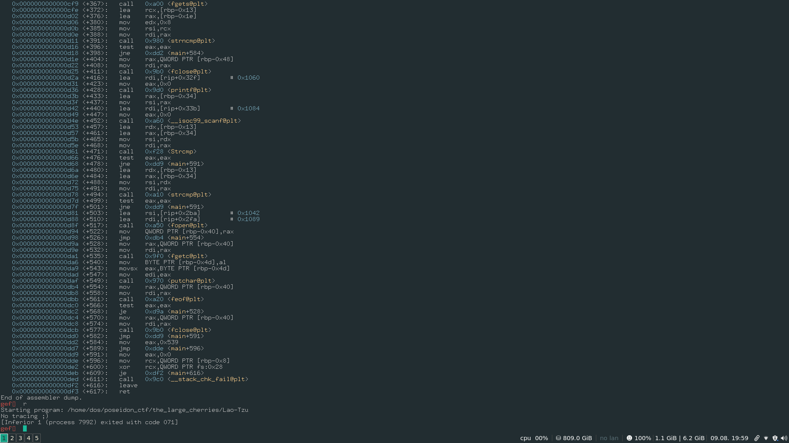
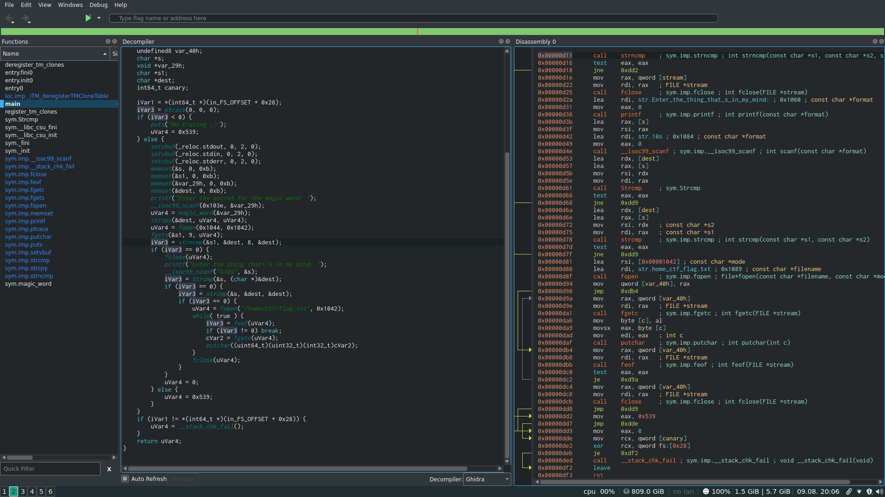
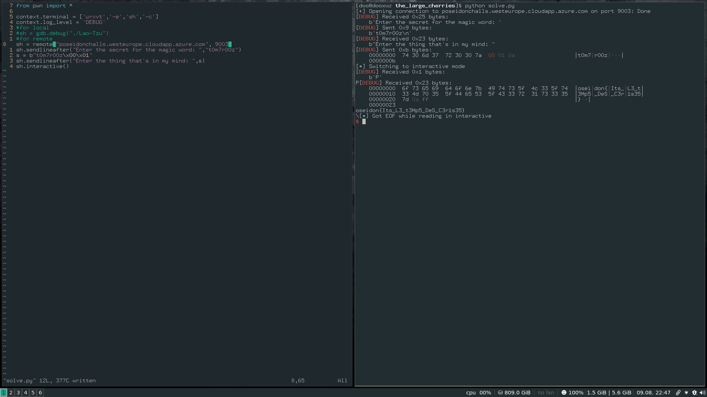

# Poseidon CTF


## The Large Cherries

Upon running the binary, we get this : 

```
./Lao-Tzu 
Enter the secret for the magic word
```

And if we enter the wrong password, it gets background. Also trying the debug using gdb gives us a `No tracing message`<br>



Also, if we check in Cutter the functions list, we see that there is a ptrace function in the binary, which prevents us from debugging it.<br>

Disassembly of the main function shows the following things : 



1) The string for the first check is taken from the function called `magic_word`.<br>
2) Then in the function called `magic_word` it goes through a series of checks<br>
3) If we reverse engineer all the checks, the authors name comes as the first password

```
t0m7r00z
```

Upon giving this as the input to the server we get the following : <br>
```
 nc poseidonchalls.westeurope.cloudapp.azure.com 9003
Enter the secret for the magic word: t0m7r00z
Enter the thing that's in my mind
```

In the second part there is a function called `Strcmp` which does the following : 

```
ulong Strcmp(long param_1)

{
  int local_10;
  int local_c;
  
  local_c = 0;
  local_10 = 0;
  while (local_10 < 10) {
    local_c = local_c + *(char *)(param_1 + local_10);
    local_10 = local_10 + 1;
  }
  return (ulong)(local_c == 0x294);
}
```

1) The loop runs till the length of the string (10).<br>
2) On each iteration it adds to the previous value.<br>
3) At the end, it checks if the value is equal to 0x294<br>

In order to debug the binary, you need to bypass the ptrace check, change the `jns 0xbd9` to 
`jmp 0xbd9` so that it jumps under all conditions.<br>
Also create a file `/home/ctf/magic_word.txt` so that it doesn't segfault while degbugging locally.<br>

The sum with which it is checked is the sum of the characters of the first password. So the second one cannot be the first password. <br>

So if we enter the `t0m7r00z\x00\x01` as our second password : 

1) The first check is done for the first 8 character<br>
2) The second check is done for 10 character<br> 
3) Therefore enter null character at the 9th position and 0x1 at the 10th<br>

I wrote the following script to debug and get my flag <br>

```
from pwn import *

context.terminal = ['urxvt','-e','sh','-c']
context.log_level = 'DEBUG'
#for local
#sh = gdb.debug("./Lao-Tzu")
#for remote
sh = remote("poseidonchalls.westeurope.cloudapp.azure.com", 9003)
sh.sendlineafter("Enter the secret for the magic word: ","t0m7r00z")
s = b"t0m7r00z\x00\x01"
sh.sendlineafter("Enter the thing that's in my mind: ",s)
sh.interactive()
```




